# Refusion explanation

---

## Refusion의 목적

복잡한 실제 이미지 복원 과제에서 효율성과 안정성을 모두 갖춘 확산 모델을 개발하는 것.

## Refusion의 적용 범위 및 성과

데이터셋과 노이즈 네트워크 설정만 바꾸어도 실세계 그림자 제거, HR 비균질 안개 제거, 스테레오 초해상도, 보케 효과 변환 등 다양한 테스크에 즉시 적용 가능

NTIRE 2023 그림자 제거 챌린지에서 최고의 지각(perceptual) 성능을 기록하고, 종합 순위 2위 달성

## 문제점

기존 딥러닝 기반 super-resolution 복원하는 방법들은 픽셀 단위 재구성 손실함수를 사용해 각 과제에서 인상적인 성능을 보여주었지만, 종종 과도하게 부드러운(over-smooth) 결과를 생성하는 경향이 있음.

기존 diffusion-model은 순수 노이즈로 이뤄진 이미지를 샘플링한 뒤 SDE을 통해 점진적으로 디노이징하는 방식으로, 매우 높은 품질의 결과를 생성할 수 있음을 최근에 보여줌. 그러나 비구조적 그림자 제거, 비균질 고해상도 안개 제거, 스테레오 초해상도, 보케 전환 등 일반적인 이미지 복원 과제는 여전히 어려워하는 경향이 있음.

사전학습된 DM 활용 연구들은 잘 정제된 데이터셋에 의존하며, 복원 과정에 열화 파라미터의 사전 지식이 필요하다는 두 가지 한계가 존재함.

이를 해결하기 위해 순수 노이즈와 LQ 이미지를 결합해 노이즈 네트워크에 입력하는 방식을 제안했지만, 이는 직관적이긴 하나 일반적 과제에 일괄 적용하기 어렵고, 경험적 설계가 많음.
이보다 일반적인 방법인 IR-SDE는 평균 회귀 SDE를 이용해 다양한 복원 과제에 데이터셋만 바꿔 적용할 수 있지만, 테스트 시 고해상도 전체 이미지에 대해 다단계 디노이징을 수행해야 하므로 계산 비용이 매우 큼. 그래서 다음과 같은 핵심 아이디어들을 사용함.

- IR-SDE : Image Restoration with Mean-Reverting Stochastic Differential Equations의 약자로, 이미지 복원을 위해 고안된 확률미분방정식 기반 모델.
손상된 LQ 이미지를 노이즈 제거, 데블러링, 리데이닝 등 다양한 복원 작업을 통해 HQ로 복원하는데 특화됨.

## 핵심 아이디어

1. IR-SDE를 기반으로, 보다 경량·효율적인 NAFNet 블록을 노이즈 예측 네트워크로 채택
2. 노이즈 수준, 디노징 단계 수, 학습 이미지 크기, 옵티마이저/스케줄러 등 하이퍼파라미터를 체계적으로 재조정
3. U-Net 기반 잠재(latent) 확산 전략을 도입해, 저해상도 잠재 공간에서 복원을 수행하되 스킵 연결(skip connections)으로 고해상도 정보를 보존

이로써 단순히 데이터셋과 노이즈 네트워크만 바꾸어도 다양한 과제에 즉시 적용할 수 있음. 제안된 모델은 Refusion은 NTIRE 2023 그림자 제거 챌린지에서 최고의 지각 성능을 기록했고, 종합 순위 2위를 달성함.

---

## 관련 연구

이미지 복원은 손상된 저화질 이미지를 고화질로 복원하는 과제로, 딥러닝 기반 초기 연구로는 이미지 초해상도를 다룬 SRCNN과 노이즈 제거를 다룬 DnCNN이 있음. 이들 연구는 각각 이미지 초해상도와 이미지 복원 분야에서 CNN을 활용해 큰 성능 향상을 이끌어냈으며, 이후 다수의 후속 연구들이 이와 유사한 구조를 채택하여 다양한 이미지 복원 과제를 다뤘음. 이들 대부분은 픽셀 단위 재구성 손실 사용함.

## 사전 지식 : 평균 회귀 확률 미분방정식(Mean-Reverting SDE)

### Forward SDE(degradation 과정)와 주변 분포(P(x))
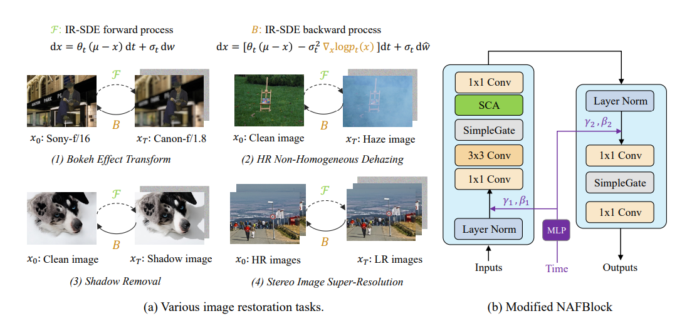

전진 과정은 다음과 같은 Ito SDE(이토 확률 미분 방정식)로 정의됨.

- Ito SDE : 결정적 드리프트 항과 확률적 가우시안을 동시에 포함해 시스템의 무작위 변화를 모델링하는 이토 형식의 확률 미분 방정식
- 이토 형식 : 확률 미분 방정식을 수치해석에 편리하도록 정의한 표기법( 비예측적( 미래 정보 불가 )인게 특징임)
- 비예측적이란? : 적분할 때 그 시점의 적분 함수(피적분함수)가 미래의 노이즈 증분을 미리 알지 못하는 것

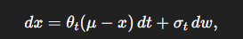

𝜃𝑡 : 시간 t에 따른 평균 회귀 속도
σt: 확률적 변동성을 나타내는 양수 함수 ( 일반적으로 σt이 커질수록 SDE의 확산 효과가 강해지고, xt 분포의 분산이 커짐 )
𝑑𝑤𝑡 : Ito 위너 프로세스("순수한" 가우시안 노이즈의 무한히 작은 증분)

우변의 첫째 항은 평균 복귀 역할을, 둘째 항은 무작위 확산 역할을 수행하면서, 시간에 따라 이미지가 점진적으로 열화되어 가는 과정을 모델링한거임. (우변의 첫째 항을 드리프트 항이라고 부르는데 이 항으로 인해 언제나 xt를 μ쪽으로 되돌리려는 힘이 발생함.)
𝜎𝑡^2  / 𝜃𝑡 = 2𝜆^2를 모든 t에 대해 만족시킨다면, 시점 t에서의 분포 pt(x)는 다음과 같이 정규분포로 주어짐. (이 식을 통해 forward SDE의 분산을 일정하게 유지하도록 설계한 것)

### Reverse-time SDE(복원 과정)와 Score function
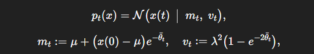

평균(mt)는 μ로, 분산(vt)는 𝜆^2로 수렴하여, 초기 상태 x(0)가 점진적으로 μ 로 회귀하며 고정된 노이즈 수준 𝜆를 지니게 됨.

전진 SDE는 정방향 표현이며, 이의 역방향 표현은 다음과 같음.

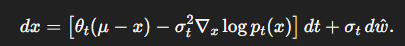

훈련 중에는 실제 HQ 이미지를 알고 있으므로, 식(2)를 이용해 정확한 스코어 함수를 계산할 수 있음.
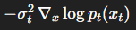는 score-기반 복원 안내임( score functon(=log 밀도 기울기)로, 어느 방향이 원본(고화질) 쪽인지를 가르켜 줌)

끝에 약간의 가우시안 노이즈를 섞어주는 이유는 이론적으로 완전한 역환산을 위해서와, 수치적 안정성과 오차 누적 방지를 위해서와 표본 다양성과 불확실성 반영 때문이다.

- Score function : 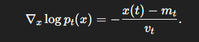

첫째항은 "얼마나" 그리고 "얼만큼의 속도로" 𝜇쪽으로 이동할지를 결정해줌
둘째항은 "정확히 어떤 방향"으로 노이즈를 제거해야 할지를 알려줌

### Reparaameterization과 Noise 추정

원래 Forward SDE로 만들어진 분포 pt(x)를 직접 다루기 어렵게 때문에, 다음과 같은 Reparameterization 공식을 사용함.

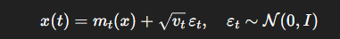를 표본화하고, 이를 바탕으로 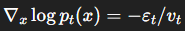를 예측하도록 CNN 네트워크를 학습함. 테스트 시에는 이 스코어 예측기를 활용해 역방향 SDE를 시뮬레이션함으로써 LQ 이미지를 HQ 이미지로 복원함.

## Improving the Diffusion Model

1. U-net 기반 잠재 확산( latent diffusion)

LDM 구조를 사용함.

인코더는 LQ 이미지를 latent 표현으로 압축하고 IR-SDE reverse process를 통해 HQ latent 표현으로 변환함. 이로부터 디코더는 HQ 이미지를 재구성함. VAE-GAN을 압축 모델로 사용하는 latent diffusion과 비교할 때 중요한 차이점은 제안된 U-Net이 skip connection을 통해 인코더에서 디코더로 흐르는 멀티스케일 디테일을 유지한다는 것. 이렇게 하면 입력 이미지의 정보를 더 잘 캡처하고 더 정확한 HQ 이미지를 재구성하기 위해 디코더에 추가 디테일을 제공함.

U-Net 모델을 학습할 때 압축된 latent 표현이 판별적이고 주요 degradation 정보를 포함하는지 확인해야 함. 또한 U-Net 디코더는 변환된 LQ latent 표현에서 HQ 이미지를 재구성할 수 있어야 함. 따라서 아래 그림과 같이 latent-replacing(잠재 교체) 학습 전략을 채택함.

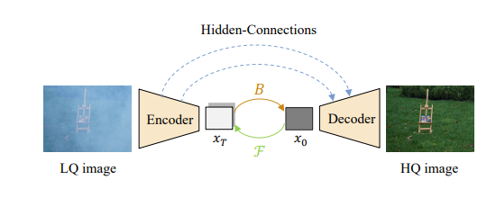
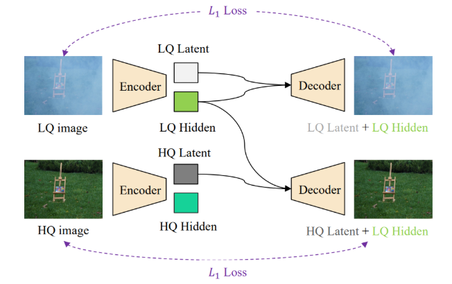

각 LQ 이미지를 인코더-디코더로 재구성한 뒤 L1 손실을 적용하고, HQ 이미지의 잠재 표현으로 교체하여 다시 디코딩한 결과에도 L1 손실을 적용함으로써, 잠재 공간이 열화 정보와 재구성 능력을 모두 잘 담아내도록 학습함.

2. 수정된 NAFBlock을 이용한 노이즈 예측

- 전통적으로 DM의 noise 예측 네트워크는 U-Net + 잔차블록 + 어텐션을 사용함. 하지만 계산 비용을 줄이기 위해, 본 논문은 비선형 활성화 제거 네트워크(NAFNet) 블록을 확산의 기본 네트워크로 사용함.

- NAFBlock은 "SimpleGate"라는 채널 분할 후 곱셈 연산만으로 비선형성을 대체하고, 레이어 정규화, 1x1,3x3 컨볼루션 등을 조합한 구조임.

(SimpleGate : 확장된 채널을 절반으로 나눈 뒤, 두 하프 텐서를 element-wise 곱하여 비선형성을 도입함.

SCA(Simplified Channel Attention) : 전역 평균 풀링 -> 단일 선형 변환 -> 채널별 스케일링(곱셈) 과정을 거쳐, 복잡한 Sigmoid나 MLP 없이도 채널 중요도를 조절함)
시간 임베딩 정보는 MLP를 거쳐 각 블록의 채널 단위 scale-shift 파라미터(γ, β)로 투영됨.

- 본 논문에서의 Modified NAFBlock은 기존 NAFBlock에 시간 조건 브랜치를 추가해, 각 denoising 단계 t의 정보를 직접 반영하도록 확장함. (사인,코사인 임베딩 -> MLP로 feature 차원과 동일한 크기의 "시간 정보 벡터" 생성 -> ConV 블록에서 feature 맵과 채널별 곱셈으로 결합)

3. 학습 전략 개선

실제 그림자 제거 과제에서, 확산 모델 성능에 주요 영향을 미치는 4가지 요소를 실험을 통해 분석함.

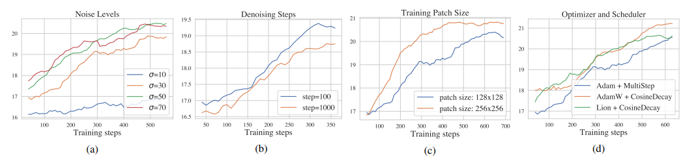

- 노이즈 수준(Noise levels)
IR-SDE의 고정 분산 λ 대신, σ={10, 30, 50, 70}을 비교한 결과 σ=50 혹은 70이 더 안정적인 학습 곡선을 보였다.

- 디노이징 단계 수(Denoising Steps)
학습 시 단계 수를 100 vs 1000으로 비교했더니, 적은 단계(100)로도 동등하거나 더 나은 복원 성능을 달성할 수 있었다.

- 학습 패치 크기(Training Patch Sizes)
128×128 vs. 256×256 패치를 비교한 결과, 큰 패치가 훨씬 더 높은 PSNR을 기록했다.

-옵티마이저 / 스케쥴러(Optimizer & Scheduler)
Adam + MultiStep, AdamW + CosineDecay, Lion + CosineDecay를 비교했으며, AdamW와 Lion이 Adam 대비 소폭 우수한 성능을 보였다.

(가로축 : 학습 진행 단계, 세로축 : 검증 데이터에 대한 PSNR(PeakSignal-to-Noise Ratio, dB 단위))

-   PSNR : 복원된 이미지와 원본 이미지 간의 차이를 수치화해 평가하는 대표적 화질 지표.

**이처럼 하이퍼파라미터를 꼼꼼히 재조정함으로써, 기존 IR-SDE 대비 복원 품질과 학습 효율성을 모두 개선할 수 있었음**

---

## 궁금증

1. 왜 전방확산 과정이라고 안 하고 점진적 열화라고 하는것인가?

-   드리프트(drift) 유무
        순수 확산 순서라면 식에 드리프트(평균 복귀) 항이 없고, dxt = σt dw와 같이 오직 노이즈 확산만 있는 형태가 됨.
        그런데 IR-SDE의 forward SDE는 dxt = θt(μ − xt)dt + σt dwt처럼 평균 복귀항이 포함되어 있음.
        즉, 단순히 무작위 확산이 아니라 평균 값 μ 쪽으로 끌어당기면서 동시에 노이즈를 추가하기 때문에, 확산이라기보다는 열화(degradation)라는 표현이 더 정확함.
