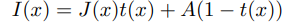
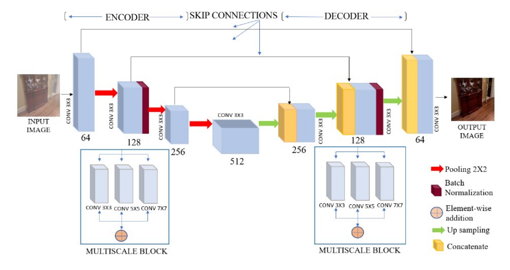
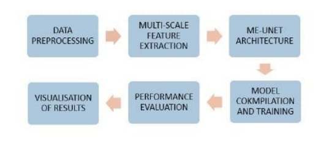
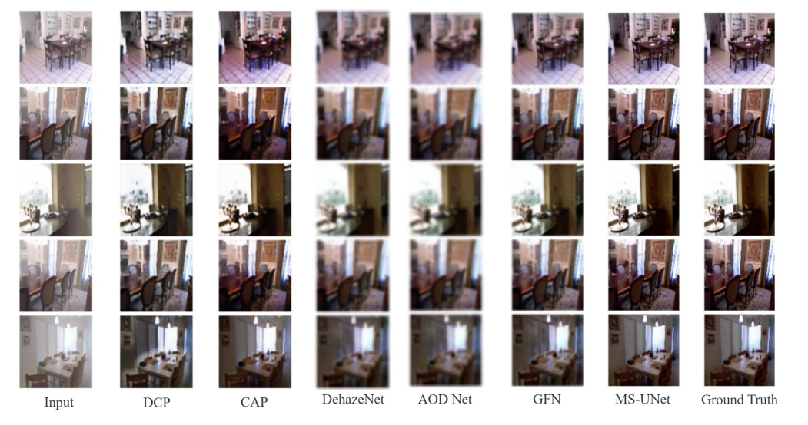
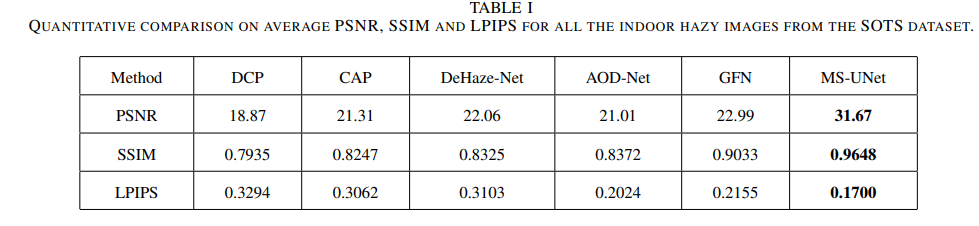

# MS-UNet 
---
## 사용한 데이터셋 
- SOTS 데이터셋

총 550장의 실내 이미지로 500장은 합성된 안개 이미지, 50장은 안개 없는 이미지로 구성되어 있음

---

## 문제 제기

- I(x): 안개 낀 이미지
- J(x): 안개 없는(정상) 이미지
- A: 대기광(global atmospheric light, 안개 때문에 추가로 섞이는 밝은 색)
- t(x): 투과도(얼마나 많은 빛이 산란 없이 카메라에 도달하는지)

기존 디헤이징 기법은 이미지 통계나 사전 지식을 활용하여 t(x)와 A를 추정한 뒤 이를 바탕으로 J(x)를 복원한다. 대표적으로는 다음과 같은 기법들이 있다.

- DCP(Dark Channel Prior) : 하늘이 아닌 영역에서는 최소 하나의 채널이 매우 어둡다는 가정
- CAP(Color Attenuation Prior) : 색 정보로부터 깊이를 추정하는 선형 모델

이러한 기법은 계산 효율성이 높고 일정 조건에서 잘 작동하기는 하지만, 다음과 같은 한계점들이 있다. 

- 처리 시간이 길고, 복잡한 안개 분포나 밀도가 불균일한 경우 성능이 저하됨
- 사전 가정에 의존하다 보니 색 왜곡이나 dehazing 실패할 가능성 높음
- 수작업으로 계산한 통계 기반 특징을 사용해서 병렬 처리에 부적합

그래서 U-Net과 같은 데이터 기반의 딥러닝 방식이 주목받기 시작했다. 본 논문에서 소개하는 MS-UNet은 U-Net을 확장한 형태로 여러 스케일의 정보를 동시에 처리할 수 있도록 설계되어, 다양한 안개 패턴과 밀도에 잘 대응할 수 있다.

---

## MS-UNet의 특징

1. 기존 U-Net에서 영감을 받아, 멀티스케일 특징 학습을 강화한 end-to-end Multi-Scale U-Net 구조 제안
2. 인코더 모듈이 다양한 해상도 경로를 통합하여 다양항 스케일의 이미지 특징 추출
3. MS 융합 블록 도입 -> 다양한 해상도의 특징 통합 -> 정밀하고 거친 특징 동시 학습 가능
4. U-Net처럼 skip connection 사용 -> 낮은 수준과 높은 수준의 특징을 안정적으로 전파
5. 성능 평가에 LPIPS, PSNR, SSIM 3가지 지표 사용
6. 제안된 MS-UNet은 기존 최신 기법보다 SSIM, PSNR, LPIPS 지표 모두에서 우수한 성능을 보임

---

## 제안 방식

본 논문에서는 자동 이미지 dehazing을 위한 Multi-branch feature 추출 및 재보정 메커니즘을 제안하며, 이는 Deep CNN 기반 아키텍처로 구성된다.
네트워크는 기존 U-Net에서 인코딩 및 디코딩 각 단계에서 여러 스케일에서의 Convolution 연산을 수행하여 풍부한 공간 및 맥락 정보를 추출한다.

---

**제안된 MS-UNet 구조**

기존 단일 ConV층 대신, 각 단계마다 3개의 병렬 Convolutional branch를 사용하는 Multi-path feature 집계 방식을 도입했다. 각 branch는 서로 다른 receptive field(수용장)을 가지므로, 정밀한 local 특징과 넓은 맥락 정보를 동시에 추출할 수 있다. various branches의 출력은 element-wise addition(요소 단위 덧셈)으로 통합되어, dehazing 성능을 위한 효과적인 Multi-Scale feature 융합을 이룬다.

**인코딩 경로**에서는 여러 개의 ConV 블록과 BatchNorm, Max Pooling을 이용해 계층적 특징을 점진적으로 추출하면서도, 중요한 특징 정보는 유지한다. (BatchNorm으로 인해 학습을 안정화시키고, 수렴 속도를 높아진다.)
이처럼 멀티스케일로 집계된 특징들은 정밀한 공간 정보 유지와 특징 표현력 향상을 기여한다.

**디코딩 경로**에서는 인코더에서 학습된 계층적 MS 특징을 대칭적으로 업샘플링 및 skip connection과 concat하여 공간 해상도를 복원한다. 각 융합 후에는 학습의 안정성과 빠른 수렴을 위한 배치 정규화가 적용된다.

모든 컨볼루션 블록에 가산 잔차 학습(additive residual learning)을 도입하여 
- 지역 및 전역 특징의 재보정 능력과 멀티스케일 표현력을 향상시켰다.
- 특징 학습을 향상시키고, 최적화를 촉진하며, gradient 소실 문제를 완화할 수 있다.

**최종 출력 레이어**에서는 3x3 컨볼루션과 배치 정규화를 사용하여 복원된 안개 없는 이미지를 생성한다. 이 아키텍처는 멀티스케일 특징 추출과 잔차 학습을 활용함으로써, 경계 정보와 세부 구조를 보존하면서 효과적으로 안개를 제거한다.

**MS-UNet을 활용한 image dehazing 절차 Block Diagram**

### Multi-Scale Feature (멀티스케일 특징)

U-Net의 멀티스케일 설계는 3×3, 5×5, 7×7 크기의 컨볼루션 필터를 사용해 특징을 추출함으로써 개선된다. 이를 통해 네트워크는 국지적(local) 및 전역적(global) 맥락 정보를 모두 포착할 수 있다.

입력 특징은 병렬 컨볼루션 레이어를 통해 각기 다른 스케일에서 처리되며, 출력은 가산 융합 방식(additive fusion) 으로 집계된다. 이렇게 계층적으로 특징을 집계함으로써, 구조적 패턴과 공간 세부 정보의 정교한 표현이 가능해진다.

이는 특히 텍스처 보존과 정보 복원이 중요한 디헤이징 작업에 매우 효과적이다.
또한, 디코더에서도 멀티스케일 블록은 skip connection을 통해 다양한 크기의 특징을 통합함으로써 특징 맵을 개선한다. 

전통적인 CNN이 풀링 과정에서 발생시키는 중요 맥락 정보 손실 문제를 본 모델처럼 다양한 스케일에서의 특징 맵을 통합함으로써 문제를 극복할 수 있다. 최종적으로, 본 아키텍처는 정교한 텍스처와 미세한 디테일을 더욱 정확히 복원함으로써 dehazing 성능을 향상시키는 구조인 것이다.

### Res2Net 기반 향상

- 제안된 멀티스케일 블록은 Res2Net 구조의 아이디어를 기반으로 한 것이다.
- 이처럼 제안된 MS-UNet 모델의 멀티스케일 특징 집계 과정은 기존 디헤이징 기법과 차별화되며, 
- 전역 맥락 파악과 세밀한 디테일 표현을 동시에 향상시킬 수 있다는 이점이 있다. 
- 또한, 3×3, 5×5, 7×7 수용 필드를 가진 병렬 컨볼루션 브랜치를 활용하여 다양한 스케일의 안개 패턴을 학습할 수 있도록 한다.
- 기존 CNN 기반 방법보다 텍스처와 경계를 보존하면서 더 뛰어난 안개 제거 성능을 보인다.

---

## Experiment Setup and Result Analysis

**Data Set : SOTS**

### 성능 평가 지표

1. PSNR(Peak Signal-to-Noise Ratio)
    - 신호 대비 노이즈 비율을 로그 스케일로 표현
    - 값이 높을수록 우수함

2. SSIM (Structural Similarity Index)
    - 두 이미지 간의 구조적 유사도를 측정
    - 사람의 시각적 인식 기준과 유사
    - 1에 가까울수록 원본과 더 유사한 것임

3. LPIPS (Learned Perceptual Image Patch Similarity)
    - 고수준 특징 공간에서의 인식적 유사도 측정(지각적 유사도 측정)
    - pretrained network(VGG, AlexNet 등)의 deep feature 차이를 기반으로 계산
    - 낮을수록 사람이 구별하기 힘듦.

### 세부 구현 사항

**학습 설정**

Optimizer: Adam

입력 패치 크기: 128×128

배치 크기: 4

초기 학습률: 1e-4

Epoch: 70

손실 함수: Binary Crossentropy + SSIM loss (정확도 + 시각 품질 모두 고려)

(Binary Crossentropy : 이진 분류에서 정답과 예측 확률 사이의 오차를 로그 기반으로 계산해서, 모델이 확실하게 틀릴수록 큰 패널티를 주는 손실 함수)

구현 프레임워크: PyTorch + GPU

**Qualitative comparison of indoor images from the SOTS dataset**

DCP: 색 왜곡(color distortion) 발생

AOD-Net: 잔여 안개(residual haze) 존재

CAP, DeHazeNet: 일부 개선되었지만 여전히 선명도가 낮음

GFN: 안개는 효과적으로 제거되었지만 색 균일도 부족, 어두운 영역에서 디테일 손실

한편, 제안된 MS-UNet은:

잔여 안개 없음

디테일 보존

색상 왜곡 없음

Ground truth(정답)와 매우 유사한 결과 생성

---

## 궁금증

1. 가산 잔차(additive residual)랑 skip connection이랑 같은게 아닌가?

- 가산 잔차는 하나의 블록에서 입력을 그대로 더하는 것 

(목적 : 학습 안정화, gradient 흐름 유지, degradation 방지)

- skip connection은 인코더의 feature map을 디코더로 concatenate 또는 add하는 것.

(목적 : 업샘플링 시 디테일 복원)

2. PSNR은 높은데 LPIPS 높으면 어떻게 보일까?

픽셀은 맞지만 시각적으로는 이상하게 블러처리된 것처럼 보일 수 있음

PSNR과 SSIM이 낮고 LPIPS도 낮으면 구조는 다르지만 시각적 품질은 비슷하다는 뜻임.
