# Multiple Linear Regression Haze-removal Model Based on Dark Channel Prior

## 문제점

기존 DCP로 복원한 이미지의 밝기는 원본 hazy 이미지보다 더 어두운 경향이 있다.
전송 맵 t(x)와 대기광 A의 추정이 거칠다는 단점이 있으며, 이는 이미지의 밝기가 실제보다 어둡거나, 하늘이나 밝은 영역에서는 색상 왜곡이 발생하는 등의 문제로 이어짐. 

본 논문은 이 약점을 보완하기 위한 개선된 알고리즘들 중 하나로 DCP 기반의 다중 선형 회귀 모델임

RESIDE 데이터셋의 학습용 데이터를 활용해 훈련되었고, 실험 결과 기존 DCP 대비 PSNR은 5.3 상승, SSIM은 0.23 향상되었으며, 시각적으로도 이미지 품질 개선이 뚜렷하게 관찰되었다.

---

## 배경

컴퓨터 비전 분야에서, hazy 이미지의 생성 과정을 설명하기 위한 고전적 모델은 대기 산란 모델임

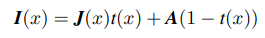

- I(x) : 흐린 이미지(관측된 픽셀 밝기)
- J(x) : 장면 복사도 (haze-free image)
- A : 대기광 (atmospheric light)
- t(x) : 매질 전송 맵 (transmission map)

여기서 J(x)t(x)는 직접 감쇠로 원래 장면에서 오는 빛을 나타내고,
A(1 - t(x))는 대기광(대기 중에서 반사되어 카메라로 들어온 빛)을 나타낸다.
 
대기가 균질하다고 가정하면, 전송 맵 t(x)는 다음과 같이 정의된다.

 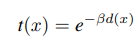

 - 𝛽 : 대기 산란 계수 (scattering coefficient)
 - d(x) : 카메라와 픽셀 위치 x의 거리, 즉 장면 깊이

이러한 대기 산란 모델을 바탕으로 대부분의 최신 단일 이미지 디헤이징 알고리즘들은 t(x)와 A를 먼저 추정한 다음, 복원된 이미지를 다음 공식을 이용해 계산한다.

 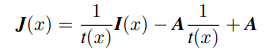

---

## 기본 알고리즘 개요

### DCP에 기반한 디헤이징 알고리즘

DCP를 공식적으로 설명하면, 이미지 J의 다크 채널은 다음과 같이 정의됨.

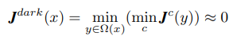

- 여기서 Ω(𝑥)는 픽셀 𝑥 주변의 지역 패치
- c는 RGB 중 하나의 색 채널을 의미
- 대부분의 비하늘 영역에서는 이 다크 채널 값이 거의 0에 수렴함

대기 산란 모델 식(1)을 양쪽에서 최소화하고, 식(2)를 대입하면, 다음과 같은 전송 맵의 추정치 𝑡^를 얻을 수 있다.

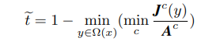

사람이 멀리 있는 물체를 인식할 수 있도록 아주 소량의 안개를 유지하도록 상수 w(0 <= w <= 1)를 도입했으며, 이를 통해 식(6)과 같은 형태로 변환했다.

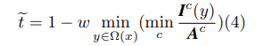

- 𝐼𝑐(𝑦) : 흐린 이미지의 색 채널 값

**대기광 𝐴**를 추정할 때는 태양광까지 고려한다.

    1. 다크 채널에서 밝은 픽셀 상위 0.1%를 선택

    2. 이 픽셀들은 일반적으로 안개가 가장 짙은 영역에 해당

    3. 이 중에서 원본 이미지 𝐼에서 밝기가 가장 높은 픽셀을 선택해 대기광 𝐴로 설정

### DCP의 한계와 개선된 알고리즘들

DCP는 전송 맵 t(x)와 대기광 A를 추정할 때 여러 한계가 존재한다. 특히 현실에서 자주 등장하는 다음과 같은 경우에 실패할 수 있다.

- 장면 객체의 색상이 대기광 A와 비슷하거나
- 그림자가 없는 넓은 영역 (ex: 눈 쌓인 땅, 흰 벽 등)

이런 경우 전송 맵이 과소평가되고, 안개층이 과대평가되어 복원된 이미지가 실제보다 지나치게 어둡게 된다.

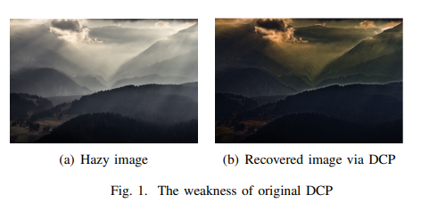

전송 맵 𝑡(𝑥) 추정은 디헤이징 알고리즘에서 매우 중요하며, DCP는 이에 대해 거친 추정만을 제공하기 때문에 많은 후속 연구들이 이를 개선하고자 했다.

기존 DCP는 소프트 매팅(Soft Matting)을 사용하여 전송 맵을 정제하지만, 이후 연구에서는 이를 가이드 필터(Guide Filter)로 대체하여 더 효율적이고 효과적인 정제를 달성한다.

### CNN 기반 디헤이징 알고리즘

딥러닝과 CNN의 발전으로, 디헤이징 분야에도 CNN 기반 알고리즘들이 적용되기 시작했다.

다중 스케일 DNN을 이용하여 coarse/fine 스케일 전송 맵을 예측

훈련 가능한 엔드-투-엔드 모델

    - 전송 맵 t(x) 추정

    - 비선형 활성화 함수 도입

CNN 기반 단일 이미지 디헤이징

    - 직접 복원 이미지 생성

    - 고수준 태스크에 쉽게 내장 가능

기존 논문들은 성능 비교 시 단순히 복원 이미지를 나열하고 시각적으로 비교하는데 그치는 경우가 많다.
-> 이러한 방식은 차이가 미미할 경우 설득력이 떨어진다.

그래서 본 논문은 대규모 데이터셋인 RESIDE를 제작하여 정량 평가, 주관 평가, 테스크 기반 평가를 모두 가능하게 했다.
-> 이를 통해 모든 디헤이징 알고리즘을 객관적으로 비교할 수 있게 되었다.

---

## Multi Linear Regression 기반 Dehazing Model

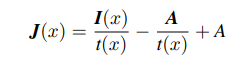

- I(x) : 흐린 이미지(관측된 픽셀 밝기)
- J(x) : 장면 복사도 (haze-free image)
- A : 대기광 (atmospheric light)
- t(x) : 매질 전송 맵 (transmission map, 안개 두께 정도)

t(x)와 A는 흐린 이미지 I(x)에서 직접 추정되므로 여전히 불완전한 오류가 발생하며, 이는 완전히 제거하기 어렵다.

본 논문은 이를 최적화하기 위해, 기존 DCP 구조는 그대로 두고, 이를 보전하는 다중선형회귀 모델을 도입한다.

### 다중 선형 회귀란?

하나의 연속형 종속 변수( 이 경우는 복원 이미지 픽셀값 J(x))와 2 개 이상의 독립 변수(예: I(x)/t(x), A​/t(x), A ) 사이의 관계를 설명하는 통계 모델

- J(x) : GT haze-free 이미지의 RGB 픽셀 값 -> 종속 변수
- I(x)/t(x), A​/t(x), A : DCP에서 추정한 세 항 -> 독립 변수

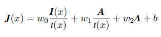

-> 세 개의 가중치 w0, w1, w2와 바이어스 b를 학습한다.

식(11)을 정리한 식

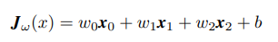

- x0 : I(x)/t(x)
- x1 : A​/t(x)
- x2 : A

이를 학습하는 방법

1. SGD(확률적 경사 하강법)를 사용하여 가중치와 바이어스를 학습
2. 학습 데이터 : RESIDE의 Outdoor Training Set(OTS)
    - 8790장의 GT 이미지
    - 각 이미지마다 30개의 다양한 안개 강도를 가진 합성 이미지 제공

-> 다양한 안개 강도에 견딜 수 있는 보정 모델을 훈련

**손실 함수**

목표 : GT 이미지 J와 예측 이미지 Jw 사이의 평균 제곱 오차(MSE)를 최소화

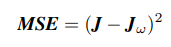

이를 기반으로 전체 손실 함수 

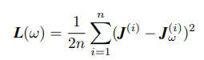

**파라미터 업데이트(SGD)**

각 이미지마다 다음 방식으로 반복 업데이트

1. 가중치 업데이트

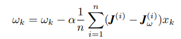

2. 바이어스 업데이트

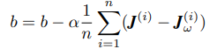

- α : 학습률(learning rate)

**결합**

학습된 w0, w1, w2, w3, b는 단순히 DCP 결과 위에 덧붙여 적용할 수 있음

-> 기존의 DCP 구조나 다른 디헤이징 알고리즘 내부를 수정할 필요 없음

-> 플러그인 방식으로 사용 가능

**한계**

RESIDE는 합성 안개 이미지만 제공 -> 실제 복잡한 안개에는 한계 있음

야간 이미지 없음 -> 어두운 조명 조건에서는 성능 저하

---
## 실험

본 논문에서는 RESIDE의 SOTS(Synthetic Object Testing Set)를 사용하여 모델의 디헤이징 성능을 평가했다.

본 알고리즘의 목적 : 실외 흐림 이미지 복원 -> 따라서 실내 합성 이미지 500장은 테스트에 포함하지 않음

**학습 단계**

RESIDE OTS의 8000장의 흐림 없는 이미지(GT)

    - 각 이미지마다 다양한 안개 강도를 가진 합성 흐림 이미지 -> 이 데이터로 모델을 학습

**테스트 단계**

SOTS의 실외 흐림 이미지 500장 + 그에 대응하는 GT 이미지 500장 사용 -> 학습된 모델을 적용해 평가

본 논문은 DCP와 성능을 비교했으며, SSIM 및 PSNR 평균값뿐 아니라 시각적으로 복원 이미지를 비교함으로써, 제안한 다중 선형 회귀 디헤이징 모델이 DCP의 약점을 얼마나 극복했는지를 검증했다.

### SOTS 실험 결과

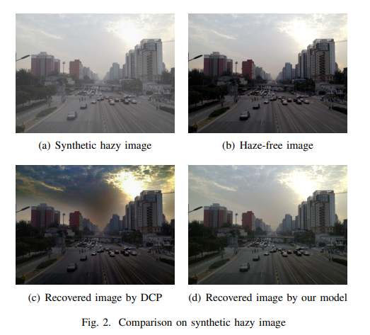

(a): SOTS에서 선택한 합성 흐림 이미지

(b): 그에 대응하는 흐림 없는 GT 이미지

(c): 기존 DCP로 복원한 이미지
→ 하늘 영역에서 색상 왜곡 발생, 전체적으로 어두움

(d): 제안한 모델로 복원한 이미지
→ 안개가 거의 완전히 제거되고, 하늘 영역도 더 자연스럽고 밝음

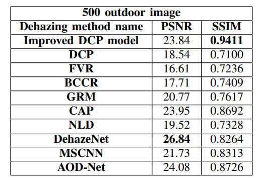

- PSNR은 DehazeNet이 가장 높지만,
- SSIM은 제안한 다중 선형 회귀 DCP 모델이 최고치를 기록

-> 기존 DCP 대비 PSNR은 5.3 향상

-> SSIM은 0.23 상승

-> 다양한 최신 알고리즘과 비교 시, PSNR은 준수하고 SSIM은 최고 성능

### 실제 흐림 이미지에서의 복원 결과

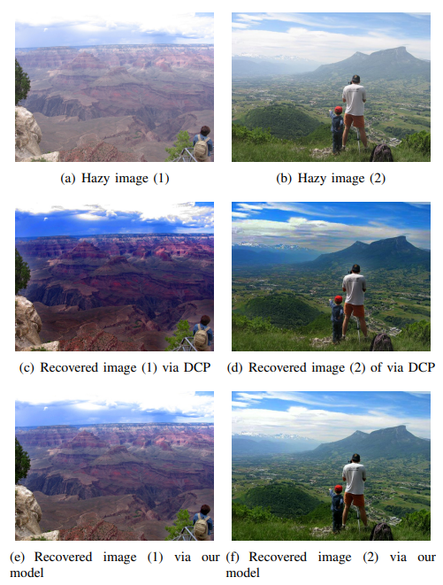

(a), (b): 자주 인용되는 흐림 이미지

(c), (d): DCP 복원 결과

(e), (f): 제안한 모델 복원 결과

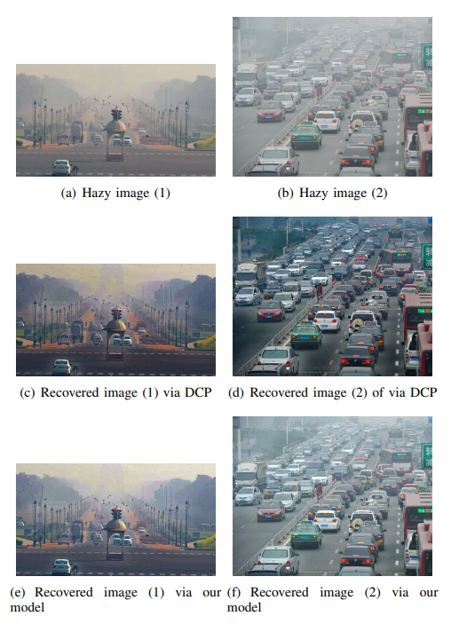

- 도시에서 촬영된 실제 흐림 이미지 2장

- 같은 방식으로 DCP와 제안 모델 복원 결과 비교

→ 모든 이미지에서 제안 모델이 더 자연스러운 밝기와 색상을 유지함

→ 특히 하늘 영역 색 왜곡과 어두움 현상 방지

### 실질적 이점

이러한 향상은 객체 탐지(object detection) 같은 실제 응용에서 유리하다.

ex: 흐림 이미지에서 차량 탐지 시, DCP는 밝기를 낮추어 탐지 정확도 감소

반면, 제안한 모델은 밝기 유지 → 탐지 정확도 향상 기대
