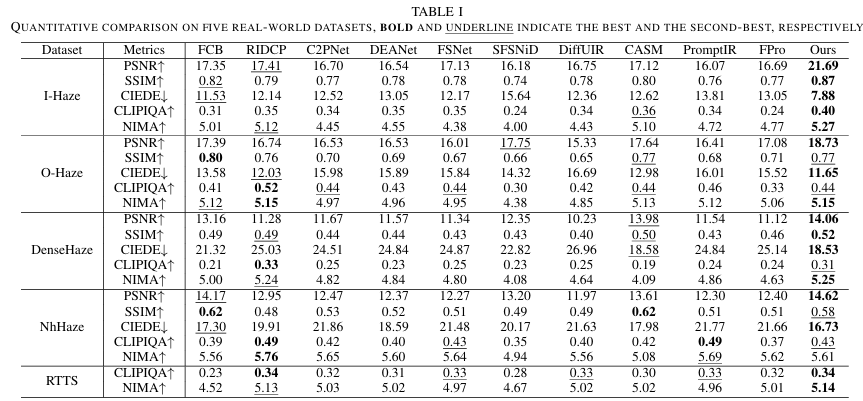

# 01_ProDehaze explanation

[논문](https://arxiv.org/abs/2503.17488)

### 사용한 traning data set
REalistic Single Image Dehazing (RESIDE)
- 안개 낀 이미지와 깨끗한 원본 이미지 쌍
I-Haze, O-Haze, DenseHaze, NH-Haze 등
- 전부 paired dataset

---
## 요약

1. 입력 이미지에서 내부 priors를 추출하여 사전 학습된 LDM(Latent Diffusion Model)이 중요한 영역에 집중하도록 프롬프트 제공
2. Structure-Prompted Restorer를 통해 구조가 뚜렷한 영역에 집중하여 디테일 충실도를 높임
    - Structure-Prompted Restorer : 구조가 잘 보이는 영역을 강조해서 latent space에서 보존하게 유도
3. Haze-aware Refiner를 통해 깨끗한 영역과 출력 이미지 간의 정렬을 유도하고 색편향을 줄임
    - Haze-aware Refiner : 비교적 덜 흐린 영역을 기준으로 더 흐린 부분을 보정하도록 유도

prompting으로 단순히 입력 이미지 외에 부가적인 정보를 줌

---
## 문제 제기

물리적 접근(Atmospheric Scattering Model(ASM) 기반)으로 안개의 두께, 조도 등을 물리적 parameter로 추정을 한다고 하면 정확한 파라미터 추정이 매우 어렵고, 실제 환경에서는 잘 안 맞음
딥러닝 모델로 hazzy -> clean 이미지를 mapping 학습하면 대부분 합성된 haze 데이터로 학습됨. 그래서 실제 안개 사진에는 일반화 성능이 약함

초기 연구들은 DM을 처음부터 학습했기 때문에, 사전학습된 생성 priors의 강력한 표현력을 활용하지 못했음. 이후에 사전학습된 LDMs을 복원에 활용해서 더 자연스럽고 사실적인 이미지 복원을 할 수 있게 됨. 그러나 실제 환경의 디헤이징에서는 hallucination 문제가 자주 발생하게 됨.
- hallucination 문제 : 사전학습된 LDM은 외부 Data set에서 학습된 "자연 이미지 분포"를 기반으로 하므로, 실제 입력 이미지의 세부사항과 맞지 않는 구조나 색을 만들어내는 경우가 많음.

prompt learning은 원래 NLP에서 개발된 것이지만, 최근에는 low-level vision tasks에도 적용되어 task 특화 priors를 활용할 수 있게 됨. 그러나 이러한 priors는 입력 이미지 내의 핵심 영역을 선택적으로 식별해 사전학습된 모델의 집중을 유도하는 능력이 부족하여, 그 효과가 희석되는 경우가 많음.
- Prompt 학습 : 프롬프트(입력 지시문)를 최적화하여 사전학습된 모델의 성능을 특정 작업에 맞게 향상시키는 기법.
- prior : 우리가 어떤 문제를 풀기 전에 미리 알고 있다고 가정하는 정보나 규칙.

---
## 문제 해결방안

해당 논문은 이러한 문제를 해결하고자, 다음과 같은 2가지 종류의 prompt를 설계함.
1. Latent 공간에서, 구조가 정교한 영역이 우선시되도록 Structure-prompted Restorer를 사용함
2. 디코딩 중에는, 안개가 심한 영역은 후순위로 처리하고, Haze-aware Self-correcting Refiner를 통해 보다 신뢰성 있는 영역에 집중함.

---
## Method

### Structure-Prompted Restorer(SPR, 구조 프롬프트 복원기)
사전학습된 LDM은 rich semantics(풍부한 의미)를 Lantent 공간에 인코딩을 함. 이 공간에서 선택적인 내부 priors, 즉 fine structures(미세 구조), contours(윤곽선), edges(엣지) 등의 시각적 단서가 복원에 중요함. 이러한 구조들은 이미지 도메인보다는 주파수 도메인에서 더 명확하게 분리됨. 그래서 high-frequency prompts(HFE, 고주파 프롬프트)를 dehazing 과정의 가이드로 사용함.

**HFE 추출**

`x_high = conv_1x1 [ (GLH * x_in) ⊕ (GHH * x_in) ⊕ (GHL * x_in) ]`

- `*` : 컨볼루션  
- `⊕` : 채널 단위 연결

1. **Haar DWT (Discrete Wavelet Transform)**  
   입력 이미지 `x_in`에서 GLH, GHH, GHL 세 가지 고주파 성분을 Haar 필터를 이용해 방향별로 추출함.  
   (Haar 필터: 이미지의 에지를 빠르게 감지하는 필터)

2. **Point-wise Convolution (1×1 Conv)**  
   3개의 고주파 성분을 채널 방향으로 concatenate한 후, 1×1 convolution을 적용해 `x_high`라는 고주파 특징을 생성.

LDM의 denoising UNet이 `x_high`의 구조 정보를 활용하기 위해, 입력 이미지 `x_in`과 고주파 특징 `x_high`를 latent space에서 encoding한 뒤, 두 벡터를 결합하여 조건 벡터 `c_f`를 만듦.

`c_f = E(x_in) ⊕ E(x_high)`

- `E`는 VAE 인코더

`c_f`는 denoising UNet의 사본을 기반으로 한 trainable adaptor `N`의 입력으로 들어가 구조 프롬프트를 injection함. 이 조건 벡터를 기반으로 Diffusion Model을 학습하고, 다음 손실 함수를 최적화함.

`L_SPR = E_{x_in, t, c_f, ε ∼ N(0,1)} [‖ε − ε_θ(z_t, t, N(c_f))‖²₂]`

- `ε_θ` : 사전학습된 denoising UNet  
- `N(c_f)` : 학습 가능한 adaptor가 주입한 조건

---

## Haze-Aware Self-Correcting Refiner (HCR)

SPR로 복원한 결과는 latent space에서는 충실도가 높지만, 최종 복원 이미지에서는 ground truth와의 불일치(hallucination)가 발생할 수 있음.

이를 보정하기 위해 **Decoder를 fine-tuning하면서 self-correction 메커니즘**을 적용함. 핵심 전략은:

- 입력 이미지의 **덜 흐린 영역**과 출력 이미지 간 **정렬을 유도**
- 안개가 심한 영역의 영향은 줄임
- 이를 위해 **Dark Channel Prior (DCP)**를 사용해 안개 밀도를 추정하고, attention map을 조정

(DCP: 안개가 낀 이미지에서는 모든 픽셀이 흐릿함. 반면 깨끗한 이미지는 어떤 채널이든 매우 어두운 값이 하나쯤은 존재)

### DCP 기반 Attention 조정

- `M_DCP ∈ ℝ^{N×1}, N = H × W` : haze density를 1D 벡터로 펼친 것

- `M_corr,l = (M_DCP * W_Q^l) * (M_DCP * W_K^l)^T`

- `W_Q^l`, `W_K^l` : 학습 가능한 가중치 (크기: `1×N_l`),  
  `N_l = H_l × W_l` : 디코더의 l번째 블록 feature 크기

- `I = { (i,j) | M_ij^corr,l ∈ Topk(M_corr,l) }`

→ corr 행렬에서 상위 k개를 선택해 인덱스 집합 `I` 생성  
→ 선택된 위치만 남기고 나머지는 억제하는 **희소 마스크** `M_s` 생성

안개가 심한 영역은 억제하고, 덜 낀 영역은 1-corr 값으로 강조함.

`attn(M_s) = softmax(((QK^T) ⊙ M_s) / N_l) V`

- `⊙`: 요소별 곱  
- Q, K, V : attention 계산의 Query, Key, Value
Window Swin Transformer(WST)를 활용한 것임.

### 최종 복원 이미지

`x_r = D(z_0; R(F_E(x_in), F_D), attn(M_s))`

- 디코더의 attention을 haze-aware prior로 조정하고,  
  학습 가능한 refine network `R`를 통해 encoder의 feature `F_E(x_in)`와 decoder의 feature `F_D`를 정렬하여 최종 복원 이미지 `x_r` 생성

---

### 최종 손실 함수

`L_HCR = ∥x_r − x_GT∥₁ + L_VGG(x_r, x_GT) + L_adv(x_r, x_GT)`

- **x_GT** : Ground truth 이미지  
- **L_VGG** : VGG perceptual loss  
  - 고수준 시각적 유사도를 반영(CNN 기반)
- **L_adv** : Adversarial loss  
  - 생성 이미지를 더 진짜처럼 보이게 학습(GAN 기반)

→ HCR 학습 시 이 손실을 최소화함

---

## Experiments

### 실험 결과 표

### 데이터셋 설명

I-Haze: 실내 장면에서 촬영된 실제 안개 이미지  
O-Haze: 실외 장면에서 촬영된 실제 안개 이미지  
DenseHaze: 매우 짙은 안개가 낀 실장면  
NH-Haze: 다양한 자연 환경에서의 실제 안개 이미지  
RTTS: Ground Truth가 없는, 현실 환경에서 직접 촬영된 안개 이미지로 구성된 비참조 평가용 데이터셋 (Non-reference)

### Reference-based Metrics (정답 이미지가 있는 경우)

PSNR (Peak Signal-to-Noise Ratio) ↑  
: 밝기 및 노이즈 차이를 정량적으로 비교하는 지표로, 클수록 원본과 유사함

SSIM (Structural Similarity Index) ↑  
: 구조적 유사도를 측정하며, 사람의 시각 시스템을 모방한 지표

CIEDE2000 ↓  
: 색상 차이를 나타내는 지표로, 값이 작을수록 원본과 색이 비슷함

### No-reference Metrics (정답 이미지가 없는 경우)

CLIP-IQA ↑  
: CLIP 모델을 활용해 추정한 이미지 품질 평가 점수

NIMA (Neural Image Assessment) ↑  
: 사람이 느끼는 품질을 예측한 모델 기반 점수

### 시각적 비교 결과

### Ablation Study(모듈별 성능 분석)

다음과 같은 표를 보면 SPR과 HCR 둘 다 있어야 진짜 최고 성능이 나오는 것을 볼 수 있음.

### 시각적 비교 결과

---

## 궁금증

1. **안개의 정도가 제각각인데, 처음 본 이미지도 복원 가능한 이유는?**

    - **SPR 단계**에서 `x_in`의 고주파 성분(`x_high`)을 Haar 필터로 추출하여 윤곽을 활용함
    - **HCR 단계**에서 `x_in` 자체에서 안개가 덜 낀 부분을 DCP로 판단하여 attention을 더 집중시킴
    - 즉, 입력에서 **신뢰 가능한 영역만 참고**하도록 구조화됨
    - 게다가 ProDehaze는 다양한 안개 농도의 데이터를 포함해 학습했기 때문에, 새로운 안개 레벨도 복원 가능함  
      → **구조 + attention + 조건화** 전략이 강력한 복원 성능의 핵심