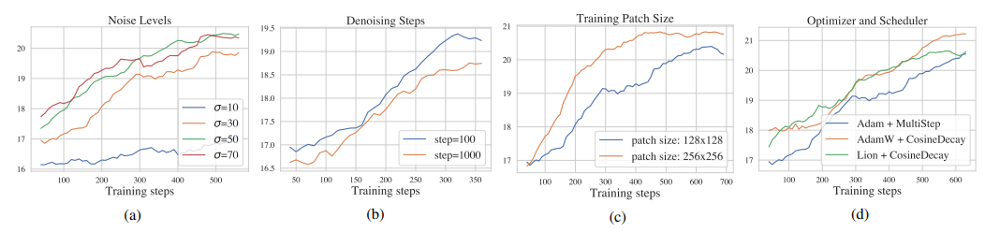

# Refusion explanation

---

## Refusion의 목적

복잡한 실제 이미지 복원 과제에서 효율성과 안정성을 모두 갖춘 확산 모델을 개발하는 것.

## Refusion의 적용 범위 및 성과

데이터셋과 노이즈 네트워크 설정만 바꾸어도 실세계 그림자 제거, HR 비균질 안개 제거, 스테레오 초해상도, 보케 효과 변환 등 다양한 테스크에 즉시 적용 가능

NTIRE 2023 그림자 제거 챌린지에서 최고의 지각(perceptual) 성능을 기록하고, 종합 순위 2위 달성

## 문제점

기존 딥러닝 기반 super-resolution 복원하는 방법들은 픽셀 단위 재구성 손실함수를 사용해 각 과제에서 인상적인 성능을 보여주었지만, 종종 과도하게 부드러운(over-smooth) 결과를 생성하는 경향이 있음.

기존 diffusion-model은 순수 노이즈로 이뤄진 이미지를 샘플링한 뒤 SDE을 통해 점진적으로 디노이징하는 방식으로, 매우 높은 품질의 결과를 생성할 수 있음을 최근에 보여줌. 그러나 비구조적 그림자 제거, 비균질 고해상도 안개 제거, 스테레오 초해상도, 보케 전환 등 일반적인 이미지 복원 과제는 여전히 어려워하는 경향이 있음.

사전학습된 DM 활용 연구들은 잘 정제된 데이터셋에 의존하며, 복원 과정에 열화 파라미터의 사전 지식이 필요하다는 두 가지 한계가 존재함.

이를 해결하기 위해 순수 노이즈와 LQ 이미지를 결합해 노이즈 네트워크에 입력하는 방식을 제안했지만, 이는 직관적이긴 하나 일반적 과제에 일괄 적용하기 어렵고, 경험적 설계가 많음.
이보다 일반적인 방법인 IR-SDE는 평균 회귀 SDE를 이용해 다양한 복원 과제에 데이터셋만 바꿔 적용할 수 있지만, 테스트 시 고해상도 전체 이미지에 대해 다단계 디노이징을 수행해야 하므로 계산 비용이 매우 큼. 그래서 다음과 같은 핵심 아이디어들을 사용함.

- IR-SDE : Image Restoration with Mean-Reverting Stochastic Differential Equations의 약자로, 이미지 복원을 위해 고안된 확률미분방정식 기반 모델.
손상된 LQ 이미지를 노이즈 제거, 데블러링, 리데이닝 등 다양한 복원 작업을 통해 HQ로 복원하는데 특화됨.

## 핵심 아이디어

1. IR-SDE를 기반으로, 보다 경량·효율적인 NAFNet 블록을 노이즈 예측 네트워크로 채택
2. 노이즈 수준, 디노징 단계 수, 학습 이미지 크기, 옵티마이저/스케줄러 등 하이퍼파라미터를 체계적으로 재조정
3. U-Net 기반 잠재(latent) 확산 전략을 도입해, 저해상도 잠재 공간에서 복원을 수행하되 스킵 연결(skip connections)으로 고해상도 정보를 보존

이로써 단순히 데이터셋과 노이즈 네트워크마 바꾸어도 다양한 과제에 즉시 적용할 수 있음. 제안된 모델은 Refusion은 NTIRE 2023 그림자 제거 챌린지에서 최고의 지각 성능을 기록했고, 종합 순위 2위를 달성함.

---

## 관련 연구

이미지 복원은 손상된 저화질 이미지를 고화질로 복원하는 과제로, 딥러닝 기반 초기 연구로는 이미지 초해상도를 다룬 SRCNN과 노이즈 제거를 다룬 DnCNN이 있음. 이들 연구는 각각 이미지 초해상도와 이미지 복원 분야에서 CNN을 활용해 큰 성능 향상을 이끌어냈으며, 이후 다수의 후속 연구들이 이와 유사한 구조를 채택하여 다양한 이미지 복원 과제를 다뤘음. 이들 대부분은 픽셀 단위 재구성 손실 사용함.

## 사전 지식 : 평균 회귀 확률 미분방정식(Mean-Reverting SDE)

전진 과정은 다음과 같은 Ito SDE(이토 확률 미분 방정식)로 정의됨.

- Ito SDE

 
𝜃𝑡와 σt는 시간 t에 따른 평균 회귀 속도와 확률적 변동성을 나타내는 양수 함수.

 
𝜎𝑡^2  / 𝜃𝑡 = 2𝜆^2를 모든 t에 대해 만족시킨다면, 시점 t에서의 분포 pt(x)는 다음과 같이 정규분포로 주어짐.

평균 mt는 μ로, 분산 vt는 𝜆^2로 수렴하여, 초기 상태 x(0)가 점진적으로 μ 로 회귀하며 고정된 노이즈 수준 𝜆를 지니게 됨.

전진 SDE는 정방향 표현이며, 이의 역방향 표현은 다음과 같음.

훈련 중에는 실제 HQ 이미지를 알고 있으므로, 식(2)를 이용해 정확한 스코어 함수를 계산할 수 있음.

재매개변수화 기법을 통해
를 표본화하고, 이를 바탕으로 를 예측하도록 CNN 네트워크를 학습함. 테스트 시에는 이 스코어 예측기를 활용해 역방향 SDE를 시뮬레이션함으로써 LQ 이미지를 HQ 이미지로 복원함.

## Improving the Diffusion Model

1. U-net 기반 잠재 확산( latent diffusion)

LDM 구조를 사용함.

인코더는 LQ 이미지를 latent 표현으로 압축하고 IR-SDE reverse process를 통해 HQ latent 표현으로 변환함. 이로부터 디코더는 HQ 이미지를 재구성함. VAE-GAN을 압축 모델로 사용하는 latent diffusion과 비교할 때 중요한 차이점은 제안된 U-Net이 skip connection을 통해 인코더에서 디코더로 흐르는 멀티스케일 디테일을 유지한다는 것. 이렇게 하면 입력 이미지의 정보를 더 잘 캡처하고 더 정확한 HQ 이미지를 재구성하기 위해 디코더에 추가 디테일을 제공함.

U-Net 모델을 학습할 때 압축된 latent 표현이 판별적이고 주요 degradation 정보를 포함하는지 확인해야 함. 또한 U-Net 디코더는 변환된 LQ latent 표현에서 HQ 이미지를 재구성할 수 있어야 함. 따라서 아래 그림과 같이 latent-replacing(잠재 교체) 학습 전략을 채택함.

각 LQ 이미지를 인코더-디코더로 재구성한 뒤 L1 손실을 적용하고, HQ 이미지의 잠재 표현으로 교체하여 다시 디코딩한 결과에도 L1 손실을 적용함으로써, 잠재 공간이 열화 정보와 재구성 능력을 모두 잘 담아내도록 학습함.

2. 수정된 NAFBlock을 이용한 노이즈 예측

- 전통적으로 DM의 noise 예측 네트워크는 U-Net + 잔차블록 + 어텐션을 사용함. 하지만 계산 비용을 줄이기 위해, 본 논문은 비선형 활성화 제거 네트워크(NAFNet) 블록을 확산의 기본 네트워크로 사용함.

- NAFBlock은 "SimpleGate"라는 채널 분할 후 곱셈 연산만으로 비선형성을 대체하고, 레이어 정규화, 1x1,3x3 컨볼루션 등을 조합한 구조임.
시간 임베딩 정보는 MLP를 거쳐 각 블록의 채널 단위 scale-shift 파라미터(γ, β)로 투영됨.

- 보케 변환이나 스테레오 입력처럼 테스크별 특징을 반영한 경량 변형도 적용함.

3. 학습 전략 개선

실제 그림자 제거 과제에서, 확산 모델 성능에 주요 영향을 미치는 4가지 요소를 실험을 통해 분석함.

- 노이즈 수준(Noise levels)
IR-SDE의 고정 분산 λ 대신, σ={10, 30, 50, 70}을 비교한 결과 σ=50 혹은 70이 더 안정적인 학습 곡선을 보였다.

- 디노이징 단계 수(Denoising Steps)
학습 시 단계 수를 100 vs 1000으로 비교했더니, 적은 단계(100)로도 동등하거나 더 나은 복원 성능을 달성할 수 있었다.

- 학습 패치 크기(Training Patch Sizes)
128×128 vs. 256×256 패치를 비교한 결과, 큰 패치가 훨씬 더 높은 PSNR을 기록했다.

-옵티마이저 / 스케쥴러(Optimizer & Scheduler)
Adam + MultiStep, AdamW + CosineDecay, Lion + CosineDecay를 비교했으며, AdamW와 Lion이 Adam 대비 소폭 우수한 성능을 보였다.

**이처럼 하이퍼파라미터를 꼼꼼히 재조정함으로써, 기존 IR-SDE 대비 복원 품질과 학습 효율성을 모두 개선할 수 있었음**

