# 01_SAM explanation

[논문](https://arxiv.org/pdf/2010.01412)

## 요약

학습 손실값만을 최소화하면 일반화 품질이 최적화 못한 경우가 흔하다. 본 논문은 손실 지형의 기하(geometry)와 일반화의 연결에 관한 선행 연구에서 동기를 얻어 **손실값과 손실 샤프니스(sharpness)를 동시에 최소화하는 새로운, 효과적인 절차를 제안한다.**

구체적으로, Shaprness-Aware Minimization(SAM)은 손실이 균일하게 낮은 이웃 안에 위치한 파라미터를 찾는다. 이는 효율적으로 경사하강을 수행할 수 있는 min-max 최적화 문제로 이어진다. CIFAR-{10,100}, ImageNet, 파인튜닝 과제 등 여러 벤치마크 데이터셋과 모델 전반에서 SAM이 일반화를 향상시킨다는 실증적 결과를 보여준다. 몇몇 설정에서는 SOTA 성능을 보고한다.

## 문제점

현재 많은 신경망 모델은 훈련 데이터를 쉽게 암기할 수 있어, 오버피팅이 용이하다. 따라서 실제로 일반화가 잘 되는 파라미터를 선택하도록 훈련하는 절차가 필수적이다. 좋은 성능을 보이려면 일반적으로 쓰이는 손실을 훈련셋에서 단순 최소화하는 것만으로는 충분하지 않다.

같은 훈련 로스 값을 갖더라도 일반화 성능은 크게 다를 수 있다. 이 때문에, SGD, Adam, RMSProp과 같은 수많은  옵티마이저와 그 설정의 선택이 중요한 설계 선택지가 되었지만, 이것과 일반화 사이의 관계를 이해하는 일은 아직 초기 단계다. 이와 관련해서 드롭아웃, 배치 정규화, 스토캐스틱 깊이, 데이터 증강, 혼합 샘플 증강 등 다양한 훈련 변형 기법이 제안 되어 왔다.

loss 지형의 평탄함과 일반화를 잇는 연결을 폭넓게 연구해왔지만, 실제로 더 평평한 최소점을 찾으려는 효율적인 알고리즘을 만들어, SOTA 모델들의 일반화를 폭넓게 개선하는 일이 쉽지 않았다.

## 본 논문의 제안

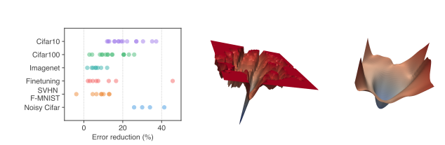

SAM 제안 : 손실값과 샤프니스를 동시에 최소화함으로써 일반화를 개선하는 새 절차. SAM은 파라미터 자체만 손실이 낮은 것이 아니라, 그 이웃 전체가 균일하게 낮은 소실을 갖도록 하는 파라미터를 찾는 것이다. 이의 장점은 구현이 쉽고 효율적이다.

광범위한 실증 : 위의 표를 보시다시피 여러가지 데이터셋이랑 각종 파인튜닝 과제 등에서 SAM을 적용하면 일반화 능력이 향상된다는 것을 볼 수 있다.
예컨대 ImageNet, CIFAR-{10,100}, SVHN, Fashion-MNIST, 표준 분류 파인튜닝 세트(Flowers, Stanford Cars, Oxford Pets 등)에서 새로운 SOTA를 달성한다.

라벨 노이즈 견고성: 라벨 노이즈에 대해, 노이즈 학습을 목표로 설계된 최신 절차들에 맞먹는 견고성을 SAM이 본질적으로 제공한다.

m-샤프니스: SAM의 관점에서 손실 샤프니스에 대한 새로운 개념(m-sharpness) 을 제시한다.

## Sharpness-Aware Minimization (SAM)

SAM은 가중치 w 근처(반경 p) 어디로 살짝만 흔들어도 (train_time) 손실이 낮은 평평한(flat) 해를 찾도록 훈련시키는 방식이다.

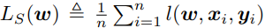

목표는 위의 식 Ls(w)를 이용해서, LD(w)가 낮은 w를 선택하는 것이다.

일반적 접근은 Ls(w)를 LD(w)의 추정치로 삼아, minw Ls(w)를 SGD, Adam 등으로 최적화하는 것이다. 그러나 과매개변수화된 현대 모델에서는 이 방식이 테스트 성능에서 최적을 보장하지 않는다. Ls(w)는 비블록이며, 여러 최소점이 있고, 같은 훈련 손실이어도 일반화는 크게 달라질 수 있아.

여기서는 샤프니스-일반화 연결에서 동기를 얻어, 손실값만 낮은 w 대신, 주변 이웃 전체의 손실이 균일하게 낮은 w를 찾고자 한다. 아래의 정리는 이웃 단위 훈련 손실로 일반화를 경계짓는 것을 직관적으로 보여준다.

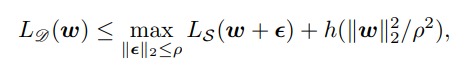

아래 식은 위의 식의 우변을 정리한 것이다.

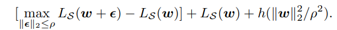

이런 목적함수가 나온 이유는 진짜로 줄이고 싶은건 모집단 손실 LD(w)여서 그런것이다.

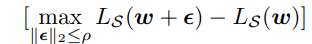

이 부분이 샤프니스로 이웃에서 손실이 얼마나 급히 올라가냐를 나타낸다. Ls(w)는 훈련 손실이고, 마지막항은 정규화항으로 여기서는 증가 함수라고 나와있다. 

여기서 h는 증명 세부에서 좌우되므로, 우리는 이를 하이퍼파라미터 λ의 L2 정규화로 대체하여 최악 이웃 손실을 직접 줄이려고 한다. 그래서 다음과 같은 목적함수가 나오게 된다. 

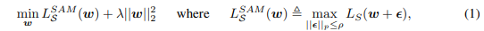

여기서 p >= 0는 이웃 크기이며, p∈[1,∞]에서 p=2가 대체로 최적이였다. 위의 fig1을 보면 일반 훈련과 SAM으로 도달한 최소점의 손실 지형을 비교한느데, SAM은 날카로운 최소점으로의 수렴을 방지하는 것을 볼 수 있다.

LS^SAM(w)를 최소화하기 위해, 우리는 내부 최대화를 통해 미분하여 ∇𝑤𝐿𝑆^SAM(𝑤)의 효율적 근사를 도출한다. 먼저 𝐿𝑆(w + ϵ)을 ϵ = 0 주위에서 1차 테일러 전개하면 아래와 같은 식이 나온다.

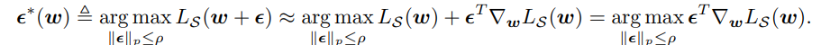

이는 고전적인 dual norm 문제의 해로 주어진다.  ϵ의 최적해는 ϵ^(w)=ρ “p-볼에서 g를 가장 잘 밀어올리는 방향” / 정규화. 아래의 식이 이런 의미를 담고 있다.

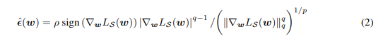

식(2)를 식(1)에 대입하고 미분하면 체인룰로 아래와 같은 근사 식이 나온다. 이 근사는 JAX/TensorFlow/PyTorch 같은 자동미분으로 쉽게 계산된다.

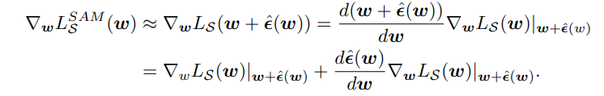

2번째 항은 계산 비용과 안정성 때문에 버리고 최종 근사를 시킨다. 그게 식(3)이다. 

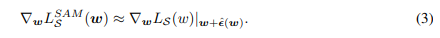

이 근사만으로도 굉장히 효과적이다. 오히려 2차 항을 포함하면 성능이 떨어진다.

최종 SAM 알고리즘은 표준 옵티마이저를 SAM 목적함수에 적용하되, 식(3)으로 기울기를 계산한다. 알고리즘 1은 SGD 기반으로 한 의사코드를 보여준 것이고, 그림 2는 한 번의 SAM 업데이트를 개략적으로 보여준 것이다.

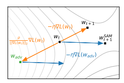

## 실증 평가

다양한 과제에서 기존 학습 절차의 옵티마이저를 SAM으로 교체하고, 테스트 일반화가 어떻게 바뀌는지 봤다.

### 분류(스크래치 학습)

CIFAR-10/100에서 SOTA 모델(ShakeShake가 적용된 WideResNet, ShakeDrop이 적용된 PyramidNet 등)을 평가했다. 이 모델들은 이미 강한 규제와 세심한 튜닝이 되어 있어, 추가 개선이 쉽지 않다. 우리의 비-SAM 구현은 기존 보고 성능과 동등/우수하도록 맞췄다.

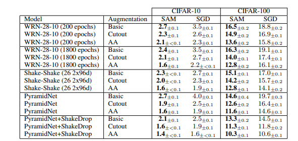

Cutout, AutoAugment 같은 강한 증강 환경도 평가.

결과 : CIFAR-10/100 전 조건에서 SAM이 개선. 예컨대, 간단한 WRN이 SAM으로 1.6% 오류(비-SAM 2.2%). 복잡 모델/규제와 독립적인 개선.
PyramidNet+ShakeDrop+CIFAR-100에서 10.3% 오류로, 추가 데이터 없이 새 SOTA.

부록(B.1)을 보면 SVHN, Fashion-MNIST에서도 WRN이 각각 0.99%, 3.59% 오류로 SOTA에 부합/상회

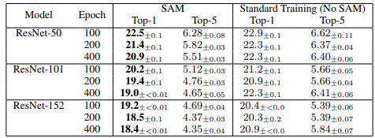

esNet-50/101/152, 입력 224, 배치 4096, 초기 LR 1.0, 코사인 스케줄, SGD+0.9 모멘텀, 라벨 스무딩 0.1, weight decay 1e-4. SAM은 
𝜌=0.05(ResNet-50 100ep 그리드로 선택). TPUv3에서 최대 400ep 학습, top-1/5 오류(평균, 95% CI, 5회).

결과 : 모든 깊이에서 일관 개선. ResNet-152 top-1 오류 20.3%→18.4%. 또한 SAM은 에폭을 늘려도 과적합 없이 정확도가 계속 향상. 반대로 비-SAM은 200→400ep에서 과적합.

### 파인 튜닝

대규모 프리트레인 모델(EfficientNet-b7, EfficientNet-L2)을 다양한 다운스트림에 파인튜닝. b7은 ImageNet만, L2는 ImageNet+JFT(입력 475). 각각 공개 체크포인트에서 시작(RandAugment 84.7%, NoisyStudent 88.2%). 하이퍼파라미터는 부록. 데이터셋별로 5회 평균/95% CI.

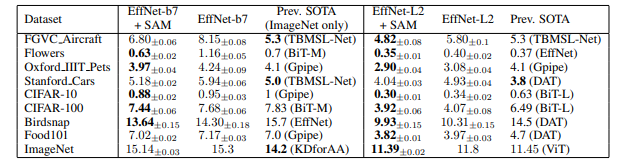

결과 : 모든 데이터셋에서 일관 개선. 다수에서 새 SOTA: CIFAR-10 0.30%, CIFAR-100 3.92%, ImageNet 11.39% 오류 등.

### 라벨 노이즈 견고성

SAM은 파라미터 교란에 견고한 해를 찾으므로, 훈련셋 노이즈(손실 지형 교란)에 대한 견고성도 기대된다. CIFAR-10에서 라벨의 일부를 무작위 뒤집는 고전 설정으로 평가(테스트셋은 깔끔). 공정 비교를 위해 간단한 ResNet-32(200ep, Jiang et al., 2019 따름). 다섯 변형: 표준 SGD, Mixup, SAM, 그리고 두 방식의 부트스트랩(초기 학습 후 예측 라벨로 재학습). 

결과 : 단순 SAM 만으로도 다수 최신 노이즈 대응 전용 기법을 상회. MentorMix에 근접하며, Bootstrap+SAM은 MentorMix에 필적.

## SAM의 렌즈로 본 샤프니스와 일반화

### m-샤프니스

도출 상 SAM 목적은 전 훈련셋에 대해 정의되지만, 실제 구현은 배치 단위, 혹은 멀티가속기에서 서브배치별로 독립 계산한 뒤 평균한다.
이는 식 (1)의 내부 최대화를 서브셋 크기 𝑚의 손실합에 대해 여러 번 분리하여 수행하는 것과 동등하다(m이 전체 크기면 원래 정의와 같음). 이때의 샤프니스 측도를 m-샤프니스라 부른다.

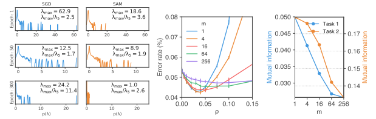

CIFAR-10 작은 ResNet에서 m을 달리해 학습하면, 작은 m일수록 일반화가 더 좋다. 이는 대규모 학습에서 필요한 데이터 병렬화와도 궁합이 좋다.

흥미롭게도, m이 작을수록 m-샤프니스는 실제 일반화 격차와의 상관이 더 커진다. 즉, 전체셋 기반의 전통적 측정보다 m < n 의 m-샤프니스가 일반화 예측 지표로 더 낫다는 시사를 준다.

### 해시안 스펙트럼

SAM이 곡률(샤프니스)가 낮은 최소점을 찾는지 확인하기 위해, CIFAR-10의 WideResNet40-10(배치정규화 제거—해시안 해석을 방해)에서 300 스텝까지, SAM 유/무로 학습하며 해시안 스펙트럼을 추정했다.

결과(그림 3 왼쪽): SAM으로 학습한 모델은 전반적 고유값 분포가 더 낮고, 최대 고유값 𝜆 max도 약 24→1.0으로 감소. 벌크 스펙트럼의 척도인 𝜆max/λ5​ 역시 최대 11.4→2.6으로 감소

## 논의 및 향후 과제
본 논문은 손실값과 샤프니스를 동시에 최소화하는 SAM을 제안했고, 대규모 실증으로 그 효능을 보였다. 이 과정에서 데이터포인트별 샤프니스(m-샤프니스) 라는, 전훈련셋 기반의 전통적(global) 샤프니스와 대비되는 관점을 제시했다. 방법론적으로는, 노이즈/반지도 학습에서 Mixup을 SAM으로 대체하는 등의 가능성(예: MentorSAM)을 시사한다. 이는 향후 심층 탐구할 가치가 있다고 본다.

## 궁금증

1. 해시안이란?
    - 해시안 행렬은 어떤 함수의 이계도함수를 이용하여 행렬을 만든 것.
